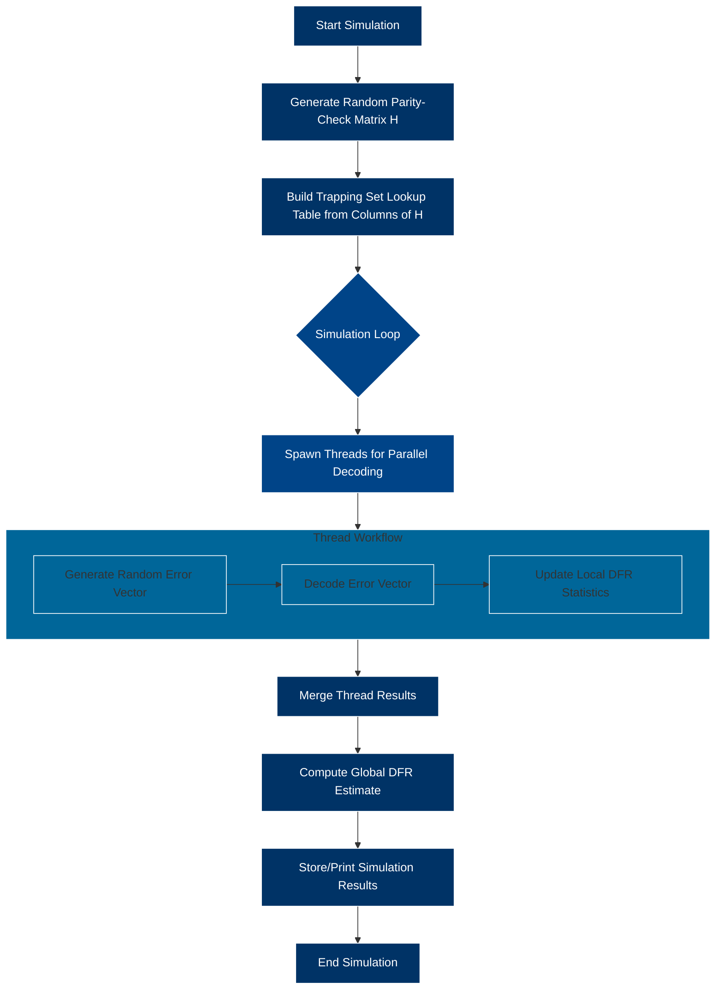

# TrappingSets_BF

This repository contains the source code used for the simulations presented in the paper:  

“Near-Codewords Aware Bit Flipping Decoding of QC-MDPC Codes”

The simulations are used to validate, through numerical experiments, a decoding approach aimed at improving the performance of Bit Flipping decoders.
All the software is written in C in order to achieve high computational performance.

## Repository Structure

The repository is organized as follows:

- `simulator`: Contains the complete source code of the simulator together with the simulation results.
- `approx_floor: Contains the code and configuration needed to estimate the error floor, following the methodology described in the paper.


The layout of the repository is the following:

- `simulator`: contains all the source code of the simulator and the results of the simulation
- `approx_floor`: contains a setup to estimate the floor as described in the paper


## Compilation and execution

Before compiling the code, the simulation parameters must be set in the file:

```
simulator/parameters.h
```
All available options and their descriptions are provided directly inside this file.


To compile the code, simply run:
```
make
```

The simulator is multi-threaded. Therefore, the number of CPU cores to be used during the simulation must be specified in params.h.

> From a computational standpoint, the simulator is computationally intensive, while its memory requirements are moderate. 



